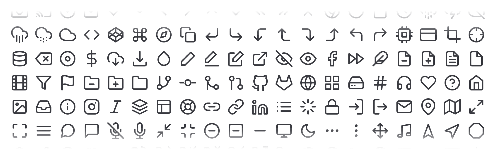

# About Wafflekit

Wafflekit is a Sketch library that helps you wireframe fast with responsive flows, typography, diagramming elements, and more.
It's completely free to use and available under the Apache License.

# Using Sketch Libraries
[Learn about Sketch Libraries via Sketch's Docs](https://sketchapp.com/docs/libraries/adding-libraries)

## Through Sketch Cloud (Recommended)

By using Sketch Cloud you'll automatically receive updates whenever a new version is available (handy for bug fixes).
Visit https://sketch.cloud/s/Qke5e and select 'Download' and then 'Add Library to Sketch'

## Direct Download

You can download the library directly [here](https://github.com/albertocamacho/wafflekit/tree/master/wafflekit). If you'd like to receive updates you'll need to download the new version and add it again to your Sketch Libraries. 

# Shapes, Colors and Text

...TBD

# UI Elements

...TBD

# Icons

Wafflekit uses [Feather Icons](feathericons.com), a library of simple open source icons created by Cole Bemis and available under the MIT License. They can be overriden with any of the kit colors and can be accessed through a few component UI symbols or the icon symbols themselves.

# Flows & Diagrams

...TBD

